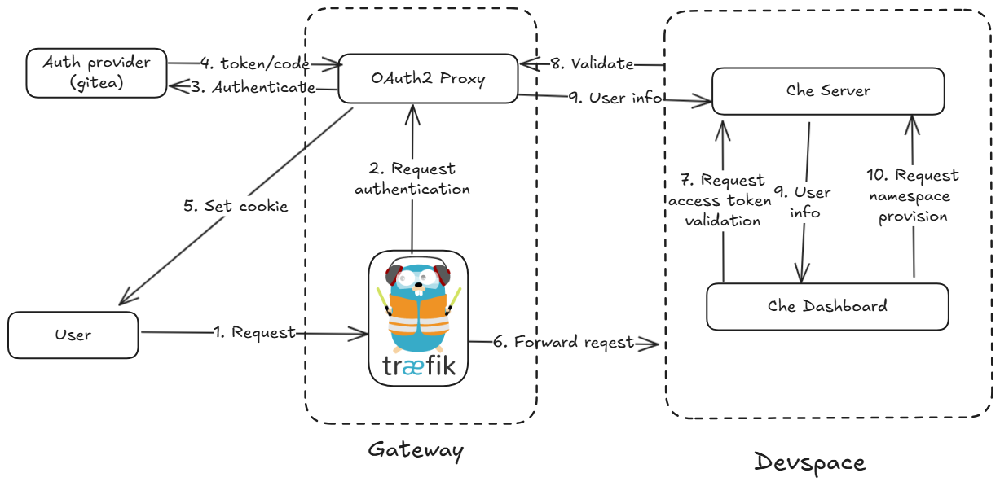

# che-docs
## 1. Các bước triển khai Che với minikube
### Prerequisites
- Cài minikube https://minikube.sigs.k8s.io/docs/start/
- Cài kubectl https://kubernetes.io/docs/tasks/tools/#kubectl
- Cài chectl https://eclipse.dev/che/docs/stable/administration-guide/installing-the-chectl-management-tool/

### Cài đặt
```
minikube start --addons=ingress,dashboard --vm=true --driver=docker --memory=6000 --cpus=4 --disk-size=50GB --kubernetes-version=v1.23.9
```

```
chectl server:deploy --platform minikube
```
## 2. Các thành phần
- ingress controller
- Dex 
- Cert-manager
- Che operator
- Che server
  - Creating user namespaces.
  - Provisioning user namespaces with required secrets and config maps.
  - Integrating with Git services providers, to fetch and validate devfiles and authentication.
- Che gateway
  - routing requests with Traefik
  - authenticate users with OAuth2 Proxy
  - Applying Kubernetes Role based access control (RBAC) policies to control access to any Che resource. It uses kube-rbac-proxy
- Che dashboard
- DWO
### Các thành phần mới sau khi deploy
- che
- che-dashboard
- che-gateway
- che-operator
- devworkspace-webhook-server
- devworkspace-controller-manager

## 3. Luồng hoạt động
### Các thành phần trong OAuth2
- **Resource Owner**: The resource owner is the user who owns the protected resources and grants access to them.
- **Client Application**: The client application is the application that wants to access the protected resources on behalf of the resource owner. This can be a web application, mobile app, or even a server-side application.
- **Authorization Server**: The authorization server is responsible for authenticating the resource owner and issuing access tokens to authorized clients. It acts as a trusted intermediary between the client application and the resource owner.
- **Resource Server**: The resource server hosts the protected resources and verifies the access tokens presented by client applications to grant or deny access.
### Luồng
1. User request: User vào DevSpace mà chưa authen. Traefik redirect user đến Oauth2 proxy
2. OAuth2 proxy kiểm tra `_oauth2_proxy` Cookie, nếu user không có cookie hợp lệ -> redirect đến Authentication Provider (gitea)
3. User login gitea và cấp quyền để OAuth2 proxy lấy thông tin user (email, tên,...)
4. Authentication Provider (gitea) gửi lại authorization token cho Oauth2 proxy
5. OAuth2 proxy dùng authorization token để xác thực danh tính user và set  `_oauth2_proxy` cookie để cấp quyền truy cập
6. Sau khi đã có `_oauth2_proxy` cookie, user được redirect đến dashboard


7. Dashboard gọi đến che server để kiểm tra cookie
8. Che server gọi đến OAuth2 proxy dể để kiểm tra cookie và lấy thông tin user. 
9. OAuth2 proxy trả kq cho Che server, Che server trả kq cho Dashboard
10. Dashboard gọi đến Che server để provision namespace cho user

### 4. TODO
- oidc - k8s rbac - authen k8s
- Luồng authen = oidc của apiserver k8s